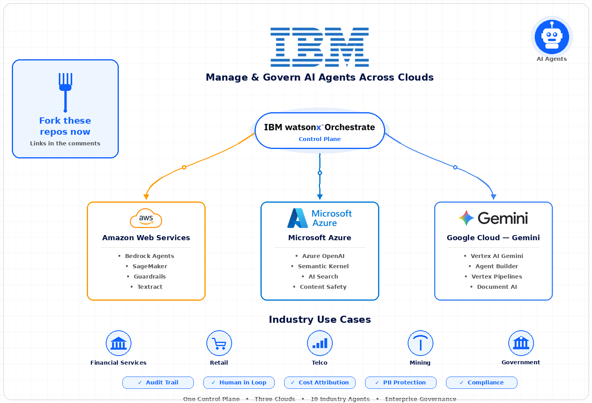
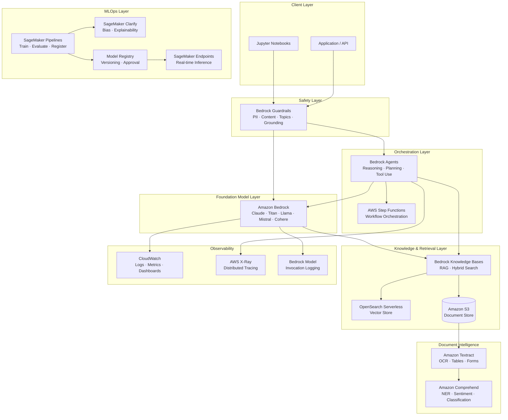
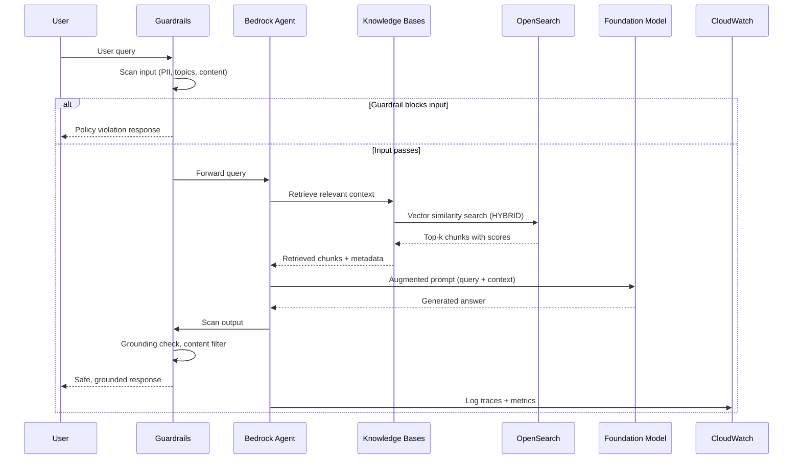
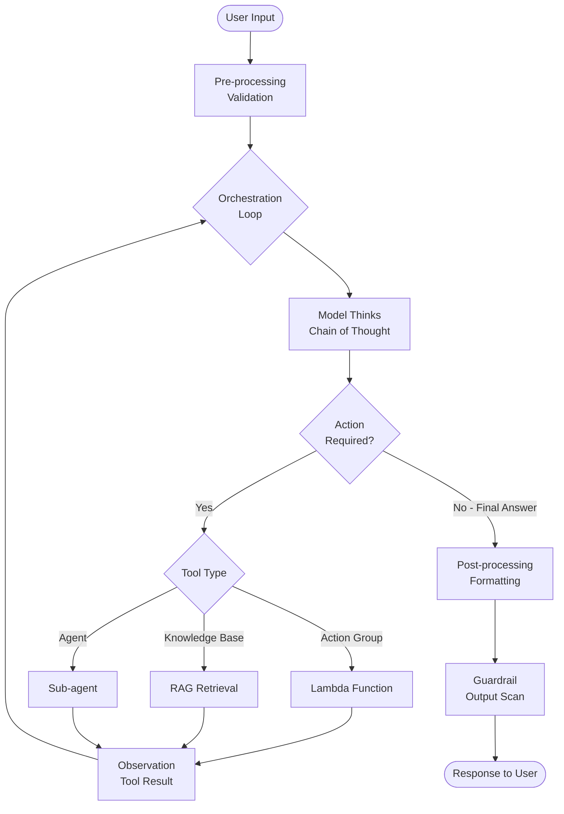
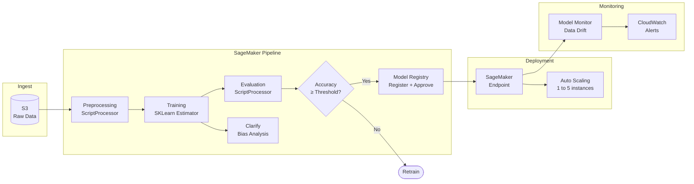
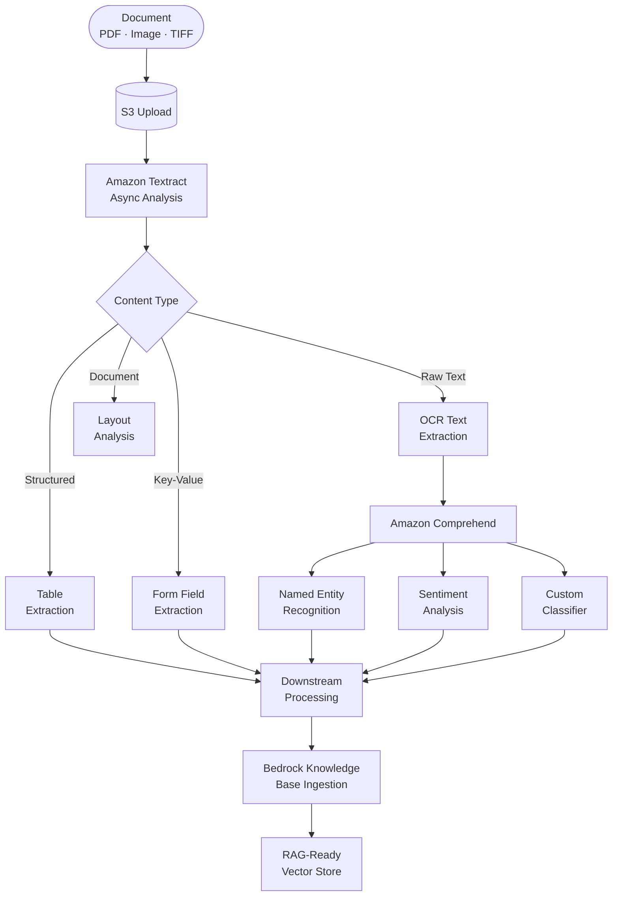
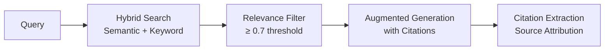
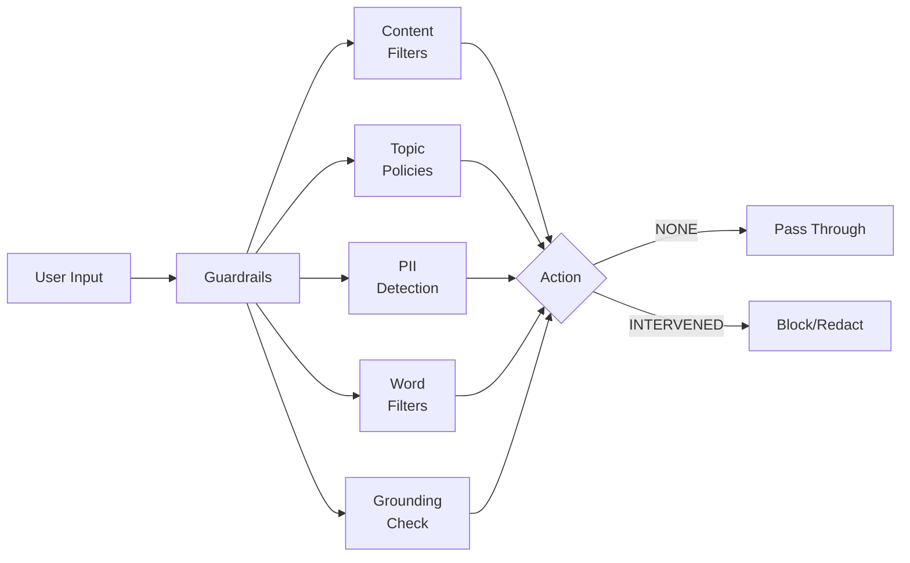

# AWS AI Platform Engineering




-yellow?logo=amazonaws)


**Author:** Ramy Amer  
**Region:** ap-southeast-2 (Sydney, Australia)  
**Python:** 3.12 | **Packaging:** pyproject.toml (Hatchling)

---

A production-grade reference implementation covering the full breadth of the AWS AI and machine learning platform. Every component is built to production standards: typed, tested, observable, and wired through a single configuration file. This is not a collection of hello-world scripts — it is the architecture pattern you deploy when AI reliability, governance, and cost control matter.

---

## Table of Contents

- [Architecture Overview](#architecture-overview)
- [Components](#components)
  - [Amazon Bedrock — Foundation Models](#amazon-bedrock--foundation-models)
  - [Bedrock Knowledge Bases — RAG](#bedrock-knowledge-bases--rag)
  - [Bedrock Agents — Orchestration](#bedrock-agents--orchestration)
  - [Bedrock Guardrails — Safety](#bedrock-guardrails--safety)
  - [Amazon SageMaker — MLOps](#amazon-sagemaker--mlops)
  - [Amazon Textract — Document Intelligence](#amazon-textract--document-intelligence)
  - [Amazon Comprehend — NLP](#amazon-comprehend--nlp)
  - [Model Evaluation](#model-evaluation)
- [Project Structure](#project-structure)
- [Prerequisites](#prerequisites)
- [Deployment Guide](#deployment-guide)
- [Configuration Reference](#configuration-reference)
- [Cost Estimates](#cost-estimates)
- [Troubleshooting](#troubleshooting)

---

## Architecture Overview

### Full Platform Architecture



### RAG Pipeline Architecture



### Bedrock Agent Tool Execution Flow



### SageMaker MLOps Pipeline



### Document Intelligence Pipeline



---

## Components

### Amazon Bedrock — Foundation Models

**Location:** `src/models/bedrock_client.py`

The `BedrockClient` provides a unified interface across all Bedrock-supported foundation models with automatic retry, cost tracking, and streaming support.

**Supported models out of the box:**

| Model | Config Key | Best For |
|-------|-----------|---------|
| Claude 3.5 Sonnet v2 | `claude_sonnet` | Complex reasoning, long context |
| Claude 3 Haiku | `claude_haiku` | Fast, cost-efficient tasks |
| Claude 3 Opus | `claude_opus` | Highest accuracy tasks |
| Amazon Titan Text Premier | `titan_text` | AWS-native, cost optimised |
| Amazon Titan Embed v2 | `titan_embed` | 1024-dim embeddings |
| Meta Llama 3 70B | `llama3_70b` | Open-weight alternative |
| Mistral Large | `mistral_large` | European data residency |
| Cohere Command R+ | `cohere_command` | Enterprise RAG |

**Usage:**
```python
from src.models.bedrock_client import BedrockClient

client = BedrockClient(model_key="claude_sonnet")

# Synchronous invocation
result = client.invoke(
    prompt="Summarise the key risks in this document.",
    system="You are a risk analyst. Be concise and precise.",
)
print(f"Response: {result.content}")
print(f"Tokens: {result.total_tokens} | Cost: ${result.estimated_cost_usd:.4f}")

# Streaming
for chunk in client.invoke_stream("Explain the CAP theorem in simple terms"):
    print(chunk, end="", flush=True)

# Embeddings
embedding = client.embed("Amazon Bedrock is a fully managed service")
print(f"Dimensions: {embedding.dimensions}")
```

---

### Bedrock Knowledge Bases — RAG

**Location:** `src/rag/knowledge_base.py`

Production RAG with hybrid search, metadata filtering, multi-turn sessions, and citation tracking.



**Usage:**
```python
from src.rag.knowledge_base import BedrockKnowledgeBaseClient

kb = BedrockKnowledgeBaseClient()

# Retrieve chunks only
chunks = kb.retrieve(
    "What is the incident response procedure?",
    max_results=10,
    search_type="HYBRID",
)
for chunk in chunks:
    print(f"[{chunk.score:.3f}] {chunk.short_source}: {chunk.content[:120]}")

# Full RAG with grounded answer and citations
response = kb.retrieve_and_generate(
    "Summarise our data classification policy",
    max_results=8,
)
print(response.format_with_citations())

# Multi-turn conversation
session_id = response.session_id
follow_up = kb.retrieve_and_generate(
    "What are the penalties for non-compliance?",
    session_id=session_id,
)
```

---

### Bedrock Agents — Orchestration

**Location:** `src/agents/bedrock_agent.py`

Full Bedrock Agent orchestration with tool use, multi-turn memory, and trace observability.

**Usage:**
```python
from src.agents.bedrock_agent import BedrockAgentClient

agent = BedrockAgentClient(enable_trace=True)
session_id = agent.new_session()

response = agent.invoke(
    "What was our cloud spend last month, broken down by service?",
    session_id=session_id,
)

# Print the agent's reasoning chain
response.print_reasoning()

# Inspect tool calls made by the agent
for action in response.action_calls:
    print(f"Action: {action['action_group']} → {action['function']}")

# Continue the conversation
follow_up = agent.invoke(
    "Which service had the biggest increase compared to the month before?",
    session_id=session_id,
)
print(follow_up.output)
```

---

### Bedrock Guardrails — Safety

**Location:** `src/guardrails/bedrock_guardrails.py`

Content safety, PII detection and redaction, topic denial, and grounding enforcement.



**Usage:**
```python
from src.guardrails.bedrock_guardrails import BedrockGuardrailsClient

gc = BedrockGuardrailsClient()

# Scan user input before forwarding to model
input_result = gc.scan_input(user_message)
if input_result.was_intervened:
    return "I cannot process that request due to content policy."

# Scan model output before returning to user
output_result = gc.scan_output(model_response, grounding_context=retrieved_context)
return output_result.safe_output

# Extract PII from text
pii_entities = gc.detect_pii("Contact John Smith at john@example.com or +61 412 345 678")
for entity in pii_entities:
    print(f"Found {entity.entity_type}: action={entity.action}")
```

---

### Amazon SageMaker — MLOps

**Location:** `src/pipelines/sagemaker_pipeline.py`

End-to-end SageMaker Pipelines with preprocessing, training, Clarify bias analysis, evaluation, conditional model registration, and endpoint deployment.

**Usage:**
```python
from src.pipelines.sagemaker_pipeline import SageMakerPipelineOrchestrator

orchestrator = SageMakerPipelineOrchestrator()

# Build and run the pipeline
pipeline = orchestrator.build_pipeline(
    pipeline_name="customer-churn-pipeline",
    training_data_s3="s3://my-bucket/data/churn-train.csv",
    model_output_s3="s3://my-bucket/models/churn/",
    accuracy_threshold=0.85,
)

execution_arn = orchestrator.upsert_and_run(pipeline)
result = orchestrator.wait_for_pipeline(execution_arn)

if result.succeeded:
    endpoint = orchestrator.deploy_registered_model(
        model_package_group_name="customer-churn-model",
        instance_type="ml.m5.large",
    )
    print(f"Endpoint: {endpoint.endpoint_name}")

# Run Clarify bias analysis
orchestrator.run_clarify_bias_analysis(
    train_data_s3="s3://my-bucket/data/train.csv",
    model_name="churn-model-v1",
    label_column="churned",
    facet_column="age_group",
    output_s3="s3://my-bucket/clarify-output/",
)
```

---

### Amazon Textract — Document Intelligence

**Location:** `src/document_intelligence/textract_client.py`

Synchronous and asynchronous document analysis with structured table, form, and layout extraction.

**Usage:**
```python
from pathlib import Path
from src.document_intelligence.textract_client import TextractClient

textract = TextractClient()

# Synchronous — images and small files
result = textract.analyse_document_sync(Path("invoice.png"))
print(f"Pages: {result.pages}")
print(f"Tables: {result.table_count}")
print(result.tables_as_markdown())

# Get form field values
gst_total = result.get_form_value("Total GST")
print(f"GST Total: {gst_total}")

# Asynchronous — PDFs via S3
job_id = textract.start_document_analysis_s3(
    s3_bucket="my-documents-bucket",
    s3_key="contracts/service-agreement-2024.pdf",
)
result = textract.wait_for_job(job_id, timeout_seconds=300)
print(f"Signatures detected: {result.signatures_detected}")
```

---

### Model Evaluation

**Location:** `src/evaluation/bedrock_evaluation.py`

LLM-as-judge RAG evaluation with four metrics (faithfulness, answer relevance, context precision, context recall) and CloudWatch metric publishing.

**Usage:**
```python
from src.evaluation.bedrock_evaluation import BedrockModelEvaluator

evaluator = BedrockModelEvaluator()

result = evaluator.evaluate_rag_response(
    question="What is the maximum file upload size?",
    generated_answer=rag_response.answer,
    reference_answer="The maximum upload size is 100MB as per section 3.2",
    retrieved_contexts=[chunk.content for chunk in retrieved_chunks],
)

print(f"Overall score: {result.overall_score:.2f}")
print(f"Faithfulness:  {result.faithfulness:.2f}")
print(f"Relevance:     {result.answer_relevance:.2f}")
print(f"Passed:        {result.passed()}")
```

---

## Project Structure

```
aws-ai-platform-engineering/
├── config/
│   └── aws_config.yaml              # ← Wire all AWS resources here
│
├── src/
│   ├── models/
│   │   └── bedrock_client.py        # Bedrock FM invocation, streaming, embeddings
│   ├── agents/
│   │   └── bedrock_agent.py         # Agent orchestration, traces, memory
│   ├── rag/
│   │   └── knowledge_base.py        # Knowledge Bases RAG, hybrid search
│   ├── guardrails/
│   │   └── bedrock_guardrails.py    # Content safety, PII, grounding
│   ├── pipelines/
│   │   └── sagemaker_pipeline.py    # SageMaker Pipelines, Clarify, endpoints
│   ├── document_intelligence/
│   │   └── textract_client.py       # Textract OCR, tables, forms, layout
│   ├── evaluation/
│   │   └── bedrock_evaluation.py    # RAG eval, LLM-as-judge, CloudWatch
│   └── utils/
│       ├── config.py                # Config loader with env var substitution
│       └── logging.py               # Structured logging (structlog)
│
├── notebooks/
│   ├── 01_bedrock_model_invocation.ipynb
│   ├── 02_rag_pipeline.ipynb
│   ├── 03_agents_and_tools.ipynb
│   ├── 04_guardrails_safety.ipynb
│   ├── 05_sagemaker_pipeline.ipynb
│   ├── 06_document_intelligence.ipynb
│   └── 07_model_evaluation.ipynb
│
├── tests/
│   ├── unit/
│   │   ├── test_bedrock_client.py
│   │   └── test_knowledge_base.py
│   └── integration/
│
├── infrastructure/
│   ├── cdk/                         # AWS CDK infrastructure-as-code
│   └── terraform/                   # Terraform alternative
│
├── scripts/
│   ├── preprocessing.py             # SageMaker preprocessing script
│   ├── train.py                     # SageMaker training script
│   └── evaluate.py                  # SageMaker evaluation script
│
├── docs/
│   └── architecture.md              # Detailed architecture decisions
│
├── pyproject.toml                   # Modern Python packaging
├── .gitignore
└── LICENSE                          # Apache 2.0
```

---

## Prerequisites

### AWS Account Setup

1. An AWS account with access to `ap-southeast-2` (Sydney)
2. Bedrock model access enabled (request via AWS console → Amazon Bedrock → Model access)
   - Enable: Anthropic Claude 3.5 Sonnet, Claude 3 Haiku, Amazon Titan Text, Titan Embeddings
3. Service quotas checked (Bedrock default: 5 RPM per model — request increases for production)

### Required IAM Permissions

Create a policy with these permissions and attach to your IAM user or role:

```json
{
  "Version": "2012-10-17",
  "Statement": [
    {
      "Effect": "Allow",
      "Action": [
        "bedrock:InvokeModel",
        "bedrock:InvokeModelWithResponseStream",
        "bedrock:ApplyGuardrail",
        "bedrock-agent-runtime:Retrieve",
        "bedrock-agent-runtime:RetrieveAndGenerate",
        "bedrock-agent-runtime:InvokeAgent",
        "bedrock-agent:StartIngestionJob",
        "textract:AnalyzeDocument",
        "textract:StartDocumentAnalysis",
        "textract:GetDocumentAnalysis",
        "comprehend:DetectEntities",
        "comprehend:DetectSentiment",
        "sagemaker:CreatePipeline",
        "sagemaker:StartPipelineExecution",
        "sagemaker:DescribePipelineExecution",
        "sagemaker:CreateEndpoint",
        "sagemaker:InvokeEndpoint",
        "s3:GetObject",
        "s3:PutObject",
        "s3:ListBucket",
        "opensearchserverless:APIAccessAll",
        "cloudwatch:PutMetricData",
        "logs:CreateLogGroup",
        "logs:CreateLogStream",
        "logs:PutLogEvents"
      ],
      "Resource": "*"
    }
  ]
}
```

---

## Deployment Guide

### Step 1 — Clone and Install

```bash
git clone https://github.com/romeosd/aws-ai-platform-engineering.git
cd aws-ai-platform-engineering

# Create virtual environment
python3.12 -m venv .venv
source .venv/bin/activate  # Windows: .venv\Scripts\activate

# Install with dev extras
pip install -e ".[dev,notebooks]"
```

### Step 2 — Configure AWS Credentials

```bash
# Option A — AWS CLI (recommended for local dev)
aws configure
# Enter: Access Key ID, Secret Access Key, Region (ap-southeast-2), Output (json)

# Option B — Environment variables
export AWS_ACCESS_KEY_ID=your-access-key
export AWS_SECRET_ACCESS_KEY=your-secret-key
export AWS_DEFAULT_REGION=ap-southeast-2

# Option C — IAM Role (for EC2/Lambda/SageMaker — no credentials needed)
```

### Step 3 — Wire the Configuration

```bash
cp config/aws_config.yaml config/aws_config.local.yaml  # Never committed
```

Edit `config/aws_config.yaml` and set your resource ARNs, or export environment variables:

```bash
export AWS_ACCOUNT_ID=123456789012
export BEDROCK_KB_ID=your-knowledge-base-id
export BEDROCK_AGENT_ID=your-agent-id
export BEDROCK_AGENT_ALIAS_ID=your-agent-alias-id
export BEDROCK_GUARDRAIL_ID=your-guardrail-id
export OPENSEARCH_COLLECTION_ARN=arn:aws:aoss:ap-southeast-2:123456789012:collection/abc123
export SAGEMAKER_EXECUTION_ROLE_ARN=arn:aws:iam::123456789012:role/SageMakerRole
export SAGEMAKER_DEFAULT_BUCKET=my-sagemaker-bucket
```

### Step 4 — Provision AWS Resources

#### 4a. Create a Bedrock Knowledge Base (via AWS Console or CLI)

```bash
# Create an OpenSearch Serverless collection first
aws opensearchserverless create-collection \
    --name aws-ai-platform-kb \
    --type VECTORSEARCH \
    --region ap-southeast-2

# Then create the Knowledge Base in Amazon Bedrock Console:
# Amazon Bedrock → Knowledge Bases → Create → Select OpenSearch Serverless
```

#### 4b. Create a Bedrock Agent

```bash
# Amazon Bedrock → Agents → Create agent
# - Foundation model: Claude 3.5 Sonnet
# - Add your Lambda functions as Action Groups
# - Add your Knowledge Base
# - Create an alias
```

#### 4c. Create Bedrock Guardrails

```bash
# Amazon Bedrock → Guardrails → Create guardrail
# - Configure content filters, PII entities, topic denials
# - Enable grounding checks for RAG responses
```

#### 4d. Create SageMaker Execution Role

```bash
aws iam create-role \
    --role-name SageMakerExecutionRole \
    --assume-role-policy-document file://infrastructure/sagemaker-trust-policy.json

aws iam attach-role-policy \
    --role-name SageMakerExecutionRole \
    --policy-arn arn:aws:iam::aws:policy/AmazonSageMakerFullAccess
```

### Step 5 — Run Tests

```bash
# Unit tests (no AWS connection required — uses mocks)
pytest tests/unit/ -v

# Integration tests (requires live AWS credentials and resources)
pytest tests/integration/ -v --integration

# Full test suite with coverage report
pytest --cov=src --cov-report=html
open htmlcov/index.html
```

### Step 6 — Run the Notebooks

```bash
jupyter lab
# Open notebooks/ and run in order: 01 → 02 → 03 ...
```

### Step 7 — Deploy Infrastructure (Optional)

```bash
# Using AWS CDK
cd infrastructure/cdk
npm install
cdk bootstrap aws://ACCOUNT_ID/ap-southeast-2
cdk deploy

# Or using Terraform
cd infrastructure/terraform
terraform init
terraform plan -var="aws_account_id=123456789012"
terraform apply
```

---

## Configuration Reference

All configuration is in `config/aws_config.yaml`. Every value supports `${ENV_VAR}` and `${ENV_VAR:-default}` substitution — no secrets are stored in the file.

| Section | Key | Description |
|---------|-----|-------------|
| `bedrock.models` | `claude_sonnet` | Claude 3.5 Sonnet v2 model ID |
| `bedrock.inference` | `max_tokens` | Max response tokens (default: 4096) |
| `bedrock.inference` | `temperature` | Sampling temperature (default: 0.1) |
| `bedrock_knowledge_bases` | `knowledge_base_id` | Your KB ID from Bedrock console |
| `bedrock_knowledge_bases.retrieval` | `search_type` | SEMANTIC / HYBRID / KEYWORD |
| `bedrock_agents` | `agent_id` | Your Agent ID |
| `bedrock_guardrails` | `guardrail_id` | Your Guardrail ID |
| `sagemaker` | `execution_role_arn` | IAM role for SageMaker jobs |
| `opensearch` | `endpoint` | OpenSearch Serverless endpoint |

---

## Cost Estimates

Approximate costs for `ap-southeast-2` region. All costs in USD.

| Component | Workload | Estimated Cost |
|-----------|---------|---------------|
| Bedrock Claude 3.5 Sonnet | 1M input + 200K output tokens/day | ~$6/day |
| Bedrock Claude 3 Haiku | 5M input + 1M output tokens/day | ~$1.50/day |
| Titan Embeddings v2 | 10M tokens/month | ~$1/month |
| Bedrock Knowledge Bases | 10GB vector store + 100K queries/month | ~$40/month |
| OpenSearch Serverless | 2 OCUs minimum | ~$350/month |
| SageMaker Pipeline run | ml.m5.xlarge × 3 steps × 30 min | ~$0.60/run |
| SageMaker Endpoint | ml.m5.large 24/7 | ~$70/month |
| Textract | 1,000 pages/month | ~$1.50/month |

> **Cost control tip:** Set AWS Budgets alerts at 80% of your monthly budget. Bedrock has no idle cost — you pay only for tokens processed.

---

## Troubleshooting

### Bedrock: AccessDeniedException

```
botocore.exceptions.ClientError: AccessDeniedException: You don't have access to the model
```

**Fix:** In the AWS Console go to Amazon Bedrock → Model access → Enable the specific model. Model access takes 2–5 minutes to propagate.

### Knowledge Base: No results returned

Check three things:
1. Data source sync has completed (Bedrock → Knowledge Bases → Data sources → check sync status)
2. The `knowledge_base_id` in config matches your actual KB ID
3. The `relevance_threshold` is not set too high for your content

### SageMaker: ResourceLimitExceeded

```
ResourceLimitExceeded: An error occurred... exceeded the limit for ml.p3.2xlarge
```

**Fix:** Switch to `ml.m5.xlarge` for development or request a quota increase via AWS Service Quotas.

### Textract: InvalidParameterException on large files

Textract synchronous API has a 10MB / single-page limit. Use `start_document_analysis_s3` for PDFs and multi-page documents.

### OpenSearch: Connection refused

Ensure your OpenSearch Serverless collection has a network access policy allowing your VPC or public access, and a data access policy granting your IAM principal `aoss:APIAccessAll`.

---

## Architecture Decisions

See [`docs/architecture.md`](docs/architecture.md) for detailed decision records covering:

- Why Bedrock Knowledge Bases over self-managed vector stores
- Hybrid search configuration for enterprise document retrieval
- Guardrails placement (input AND output scanning)
- SageMaker Pipelines vs Airflow for MLOps
- Multi-model strategy and when to use each foundation model

---

## Contributing

This repository follows conventional commits. Run `pre-commit install` after cloning to enable formatting and linting hooks.

```bash
pre-commit install
git commit -m "feat(rag): add metadata filtering to knowledge base retrieval"
```

---

*Built by Ramy Amer — AWS AI Platform Engineering | ap-southeast-2*
